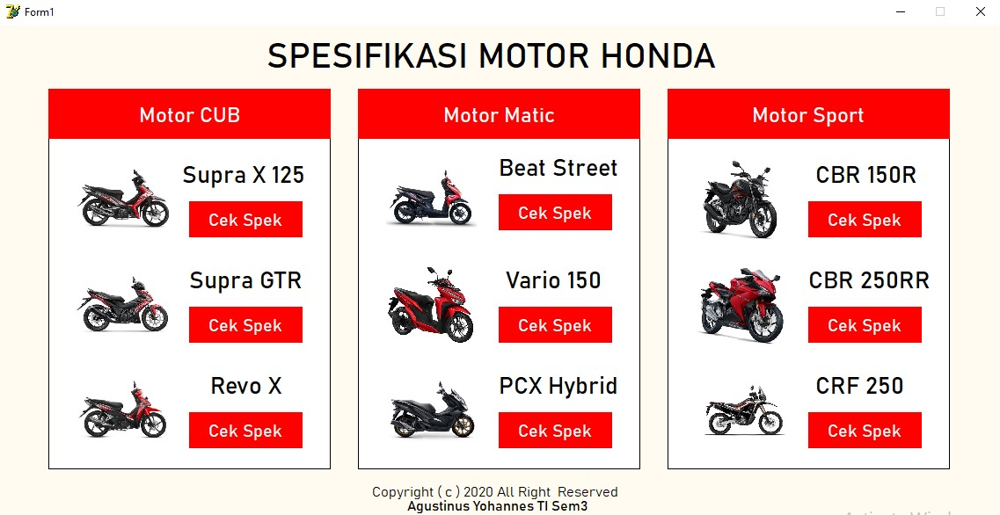
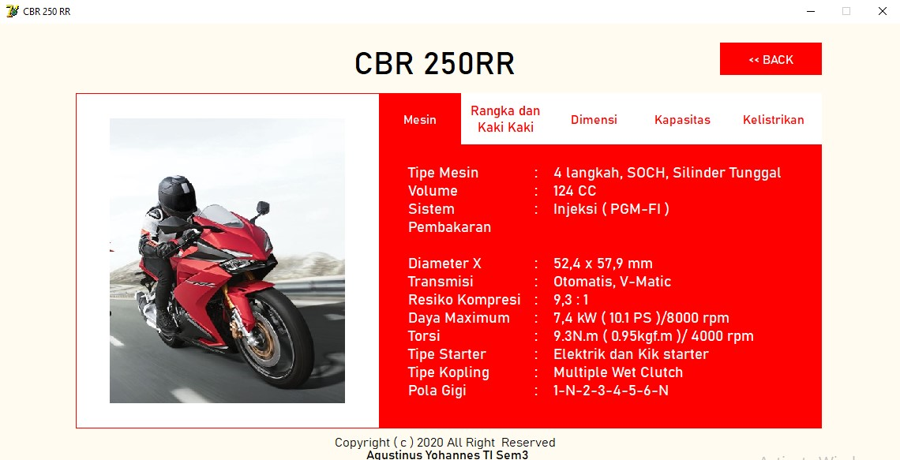

# Delphi Input Output Program Example
Contoh aplikasi penerapan konsep Input Output Daftar Tipe Motor merk Honda dengan menggunakan Delphi

Tampilan Awal setelah dijalankan

Tampilan detail Sepeda Motor

## Komponen
- Button
- Label
- Shapes
- Picture

### Fitur
1. Menggunakan Konsep Inputt output
2. Sumber data dari Laman resmi Astra Honda Motor
3. Tiap Detail kendaraan dipisahkan pada form berbeda

#### Kritik dan saran dipersilahkan :D